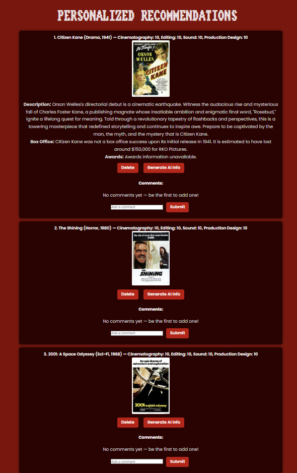
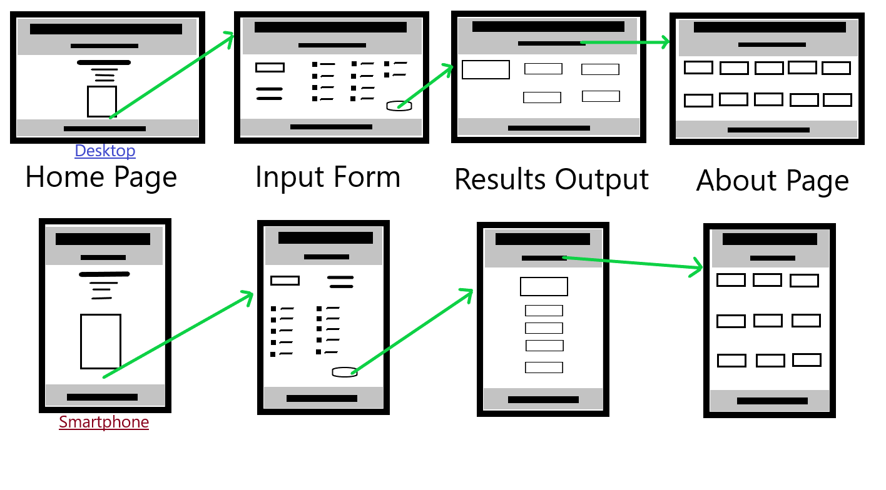

# 🎬 August's Movie Recommendations!
**My LaunchCode Capstone**


---

## 📋 Table of Contents
- [Project Overview](#-project-overview)
- [Features](#-features)
- [Technologies Used](#-technologies-used)
- [Installation & Setup](#️-installation--setup)
- [Usage](#️-usage)
- [Wireframes & ERD](#-wireframes--erd)
- [Unsolved Problems / Future Features](#-unsolved-problems--future-features)
- [Additional Content & Resources](#-additional-content--resources)
- [Acknowledgments](#-acknowledgments)

---

## 🎥 Project Overview
**August's Movie Recommendations** is a full-stack web application designed to help users discover new movies through AI-powered suggestions and creative search tools.  

Users can generate random recommendations, filter by genre or filmmaking aspects, and explore detailed results in a visually appealing interface.  

This project demonstrates front-end React development, RESTful API integration, and full-stack deployment skills developed during LaunchCode's Unit 2.

---

## ✨ Features
- 🎲 **Random Movie Generator** – Get spontaneous suggestions instantly.  
- 🔍 **Smart Recommendation Search** – Personalized movie ideas using AI logic.  
- 🎞️ **Genre & Aspect Filters** – Explore films by type or filmmaking aspects.  
- 💬 **Comment Section** – Users can discuss or leave feedback.  
- 💾 **Backend Integration** – Fetch and persist movie data.  
- 📱 **Responsive Design** – Works smoothly across desktop and mobile.

---

## 🧠 Technologies Used

| Category | Tools / Frameworks |
| :-- | :-- |
| **Frontend** | React, JavaScript, Vite |
| **Backend** | Java, Spring Boot |
| **Database** | MySQL |
| **Styling** | CSS |
| **Hosting** | Netlify (frontend) |
| **Version Control** | Git & GitHub |
| **Other Tools** | Postman, Figma, Lucidchart |

---

## ⚙️ Installation & Setup

To run the app locally:
```bash
# 1️⃣ Clone the repository
git clone https://github.com/augustkeller/final-practice-unit-1-august-k

# 2️⃣ Navigate to the frontend folder
cd final-unit-1

# 3️⃣ Install dependencies
npm install

# 4️⃣ Run the development server
npm run dev
```

If you are running the backend separately:
```bash
# 5️⃣ Navigate to the backend folder
cd backend

# 6️⃣ Run the Spring Boot application
./mvnw spring-boot:run
```

Once both servers are running, visit `http://localhost:5173` in your browser.

---

## 🖼️ Usage

Here's what users can expect to see:

<div align="center">
  
  <p><em>Example: Homepage displaying random movie recommendations.</em></p>
</div>

<div align="center">
  
  <p><em>Example: Search results generated through filtered movie suggestions.</em></p>
</div>

### Quick Guide
- Use the search bar to find recommendations.
- View movie details and descriptions.
- Generate random movies to explore something new.

---

## 🧩 Wireframes & ERD

### Wireframe (UI Layout)
  
*Wireframe created in Figma showing core page structure.*

### Entity Relationship Diagram (ERD)
  
*ERD created in Lucidchart visualizing backend data relationships.*

---

## 🚧 Unsolved Problems / Future Features
- 🔐 Add user authentication for saving favorites.
- 🌗 Implement dark/light mode toggle.
- 🧠 Improve AI recommendation logic with mood analysis.
- 🗂️ Add filtering by streaming platform.
- 💬 Enable threaded comments and rating features.
- 📱 Expand responsive design with mobile-first enhancements.

---

## 📚 Additional Content & Resources

### Design & Documentation Tools
- [Figma](https://www.figma.com/) – Wireframes & UI design
- [Lucidchart](https://www.lucidchart.com/) – ER diagrams
- [Postman](https://www.postman.com/) – API testing

### Deployment
- [Netlify](https://www.netlify.com/) – Frontend hosting

### Markdown References
- [Markdown Guide: Basic Syntax](https://www.markdownguide.org/basic-syntax/)
- [GitHub Docs: Writing on GitHub](https://docs.github.com/en/get-started/writing-on-github)
- [Shields.io](https://shields.io/) – Add badges to your README

---

## 🙌 Acknowledgments

**Created by August Keller**

Special thanks to:
- **LaunchCode** and my instructors for their support and guidance.
- Classmates and peers who provided valuable feedback throughout development.

<details>
<summary>💡 Click to reveal a fun developer joke</summary>

"Why did the developer go broke?  
Because he used up all his cache!" 😅

</details>
